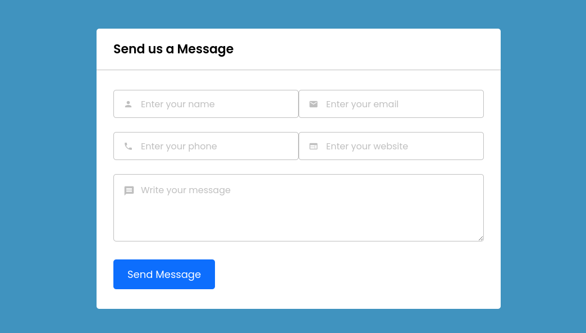

# modularized-contact-form

---




---
## Setup locally
1. Cloning the repository
```bash
git clone https://github.com/Meiroudii/modularized-contact-form.git
```
Make sure to put this directory to the `xampp/htdocs/`

2. Then start the apache server

3. Go to your favorite browser then open this link.
```bash
http://localhost:80
```

## NOTICE:
I use snake case(`snake_case`), to the variables and function in Javascript.
In order to differentiate Javascript's built-in methods, and my written code.

## NOTE:
You need to host this, in order to the PHP's `mail()` method to work.
